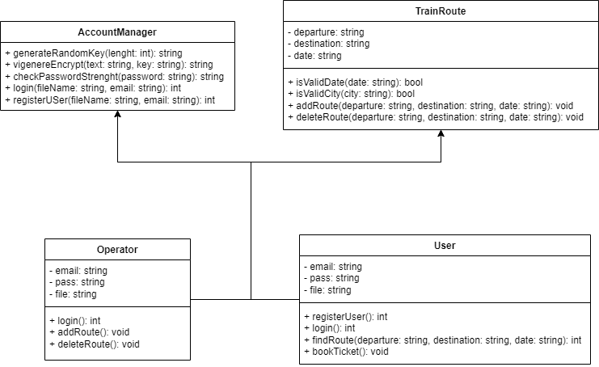

# 🚆 Train Reservation System (C++)

A simple console-based train travel reservation system built as a university assignment, focusing on core concepts of **authentication**, **authorization**, and **basic data security**.

---

## 🔐 Security Features

This project demonstrates basic security mechanisms used in applications that require user management and data protection:

### 1. Authentication and Authorization
- **Operator Login**: Predefined operators are authenticated using credentials stored in a secure CSV file.
- **User Registration & Login**: End-users can register and log in using email and password.
- Role-based access control:
  - **Operators** can add or delete train trips.
  - **Users** can search for available trips and reserve seats.

### 2. Exception Handling
Robust exception handling with custom messages and validation for:
- Invalid operator login (wrong username or password)
- Invalid or weak user password
- Invalid email format
- Repeated password mismatch
- Malformed travel dates or dates in the past
- Invalid city names (non-alphabetic characters)
- Nonexistent train trips
- Wrong reservation details (e.g., missing class or time)

All exceptions are handled using `try-catch` blocks to ensure program stability.

### 3. Password Strength Estimation
A built-in password strength checker evaluates user passwords as:
- `weak`
- `ok`
- `good`

🔒 If a password is rated as `weak`, it will be rejected and must be re-entered.

Criteria include:
- Minimum length
- Use of uppercase, lowercase, numbers, and symbols

### 4. Password Encryption (Vigenère Cipher)
User passwords are encrypted before being stored in CSV using the **Vigenère Cipher** (a classical polyalphabetic substitution cipher).

🛑 **Note**: Vigenère is used here for educational purposes only and is not recommended for production use.

---

## 🧾 Login Workflow

1. User inputs email and password.
2. System checks:
   - Email format
   - Password strength
3. Password is encrypted via Vigenère Cipher.
4. Encrypted password is validated against stored credentials (from CSV).
5. Access is granted based on the user’s role (Operator/User).

---

## 🛡️ Potential Security Improvements

To make the system more secure and production-ready:
- Replace Vigenère Cipher with modern hashing algorithms (e.g., `bcrypt`, `Argon2`)
- Use database instead of plain CSV files
- Add Two-Factor Authentication (2FA)
- Limit login attempts (brute-force protection)
- Implement secure session management

---

## 📁 Project Structure

```
Train/
├── eng_train.cpp         # Main C++ application
├── users.csv             # Stores registered users with encrypted passwords
├── operators.csv         # Stores operator credentials
└── README.md             # This file
```

---

## 🧩 Class Diagram



The system is implemented using basic object-oriented principles with classes such as:
- `User`
- `Operator`
- `Trip`
- `Reservation`
- `AuthenticationManager`
- `ExceptionManager`

---

## 📚 Key Concepts

| Concept        | Description |
|----------------|-------------|
| **Authentication** | Verifying a user's identity (e.g., checking email & password). |
| **Authorization**  | Granting access based on user role (Operator or User). |
| **Login**          | The process of authenticating users before giving access to the system. |

---

## 🛠 Technologies Used

- **C++ Standard Library**
- **File I/O with CSV**
- **OOP (Classes, Inheritance, Exception Handling)**
- **Custom Encryption (Vigenère Cipher)**
